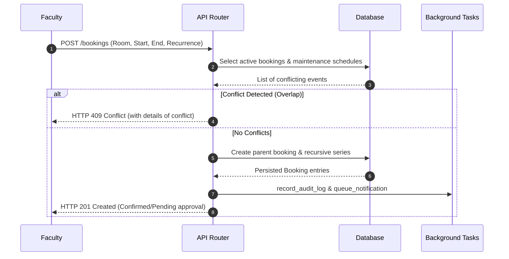
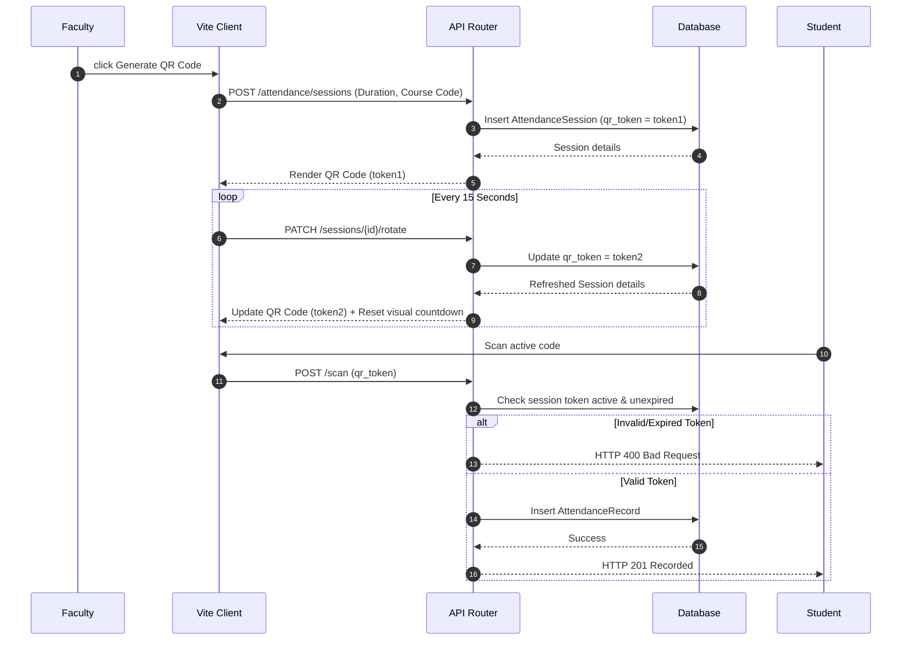
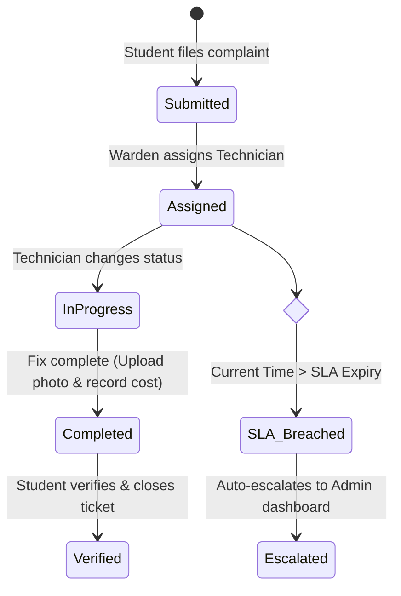

# Smart Campus Infrastructure Platform (SCIP)

SCIP is a premium, production-ready SaaS platform built to digitize and automate university campus operations. The application is designed to handle infrastructure reservation, asset inventory, hostel maintenance, and academic attendance tracking with role-based dashboard widgets, visual schedulers, dynamic barcode labels, and background SLA tracking.

---

## 🏛️ System Architecture

SCIP implements a modern decouple-architecture with a React Single Page Application (SPA) on the frontend and an asynchronous Python FastAPI service on the backend, sharing data through a transactional PostgreSQL engine.

```mermaid
graph TB
    subgraph Client Layer (Frontend)
        A[Vite + React 19 Client] --> B[Theme Provider (Glassmorphic Dark/Light)]
        A --> C[Global Search & Command Palette]
        A --> D[Visual Calendar Scheduler]
        A --> E[Dynamic QR Attendance Scan]
    end

    subgraph Service Layer (Backend)
        F[FastAPI Router Gateway] --> G[Auth Middleware (JWT Claims & RBAC)]
        F --> H[Booking & Reservation Manager]
        F --> I[Maintenance SLA & Costing Scheduler]
        F --> J[Equipment QR & Warranty Auditing]
        F --> K[Semantic Search & Matcher]
    end

    subgraph Database Layer
        L[(Supabase PostgreSQL Database)]
        M[Alembic Migrations Manager] --> L
    end

    subgraph Worker Layer (Background Task Queue)
        N[FastAPI BackgroundTasks Executor] --> O[Audit Log Service]
        N --> P[Notification Center Dispatcher]
    end

    A -- HTTP REST API / JSON --> F
    F -- SQLAlchemy 2 ORM --> L
    G -- Claims Verification --> L
    F -- Dispatch Tasks --> N
```

---

## ⚡ Domain Operations & Flowcharts

### 1. Classroom Booking & Conflict Prevention
To avoid double-bookings, SCIP enforces database-level constraints and checks for overlapping timeslots (utilizing PostgreSQL `tstzrange` exclusion constraints) before confirming a reservation.



### 2. Anti-Share QR Attendance System
Attendance QR codes rotate automatically on the teacher's dashboard every 15 seconds to prevent students from taking photos and sharing them.



### 3. Complaints Priority & SLA State Machine
Maintenance issues are governed by strict Service Level Agreements (SLAs). Urgency determines the response time window, automatically escalating to administrators if breached.



---

## 🛠️ Local Development & Running

### 1. Prerequisites
- **Node.js**: `v20+`
- **Python**: `3.12+`
- **PostgreSQL**: Supabase Database connection (or local Postgres fallback)

### 2. Backend Setup
1. Move to backend folder and create venv:
   ```bash
   cd backend
   python -m venv .venv
   .venv\Scripts\activate
   ```
2. Install dependencies:
   ```bash
   pip install -r requirements.txt -r requirements-dev.txt
   ```
3. Run migrations and start FastAPI:
   ```bash
   alembic upgrade head
   python -m uvicorn app.main:app --port 8000 --reload
   ```

### 3. Frontend Setup
1. Move to frontend folder and install node modules:
   ```bash
   cd frontend
   npm install
   ```
2. Copy environment file and run:
   ```bash
   copy .env.example .env
   npm run dev
   ```
3. Open `http://localhost:5174/` in your browser.

---

## 🧪 Testing & Code Quality

SCIP enforces strict testing coverage across modules. We utilize transaction-nested testing database hooks to keep testing fast and clean:

### Run Quality Gates
- **Typecheck codebases**:
  - Backend: `mypy app`
  - Frontend: `npx tsc --noEmit`
- **Format checks**:
  - Backend: `ruff check .`
  - Frontend: `npm run lint` / `npm run format:check`
- **Run Backend integration tests**:
  ```bash
  cd backend
  .venv\Scripts\pytest
  ```
