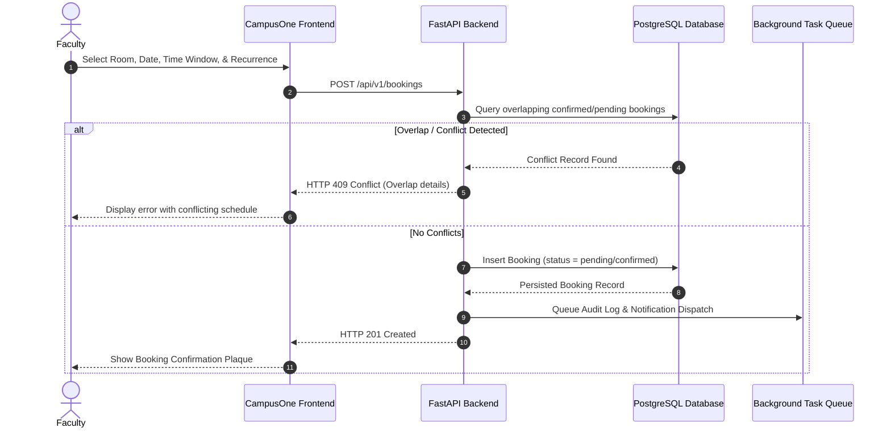
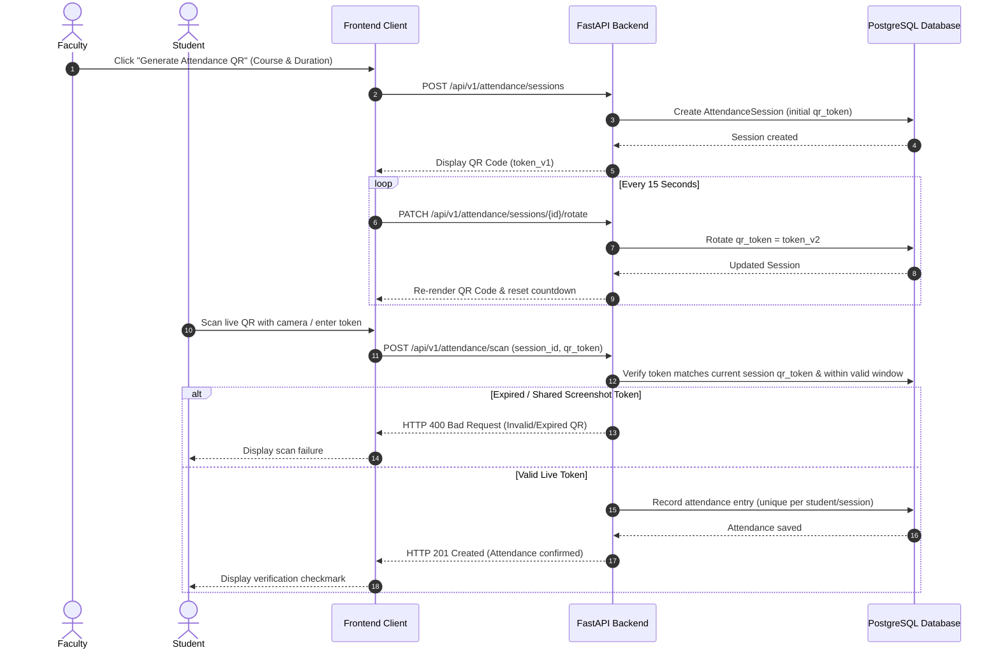
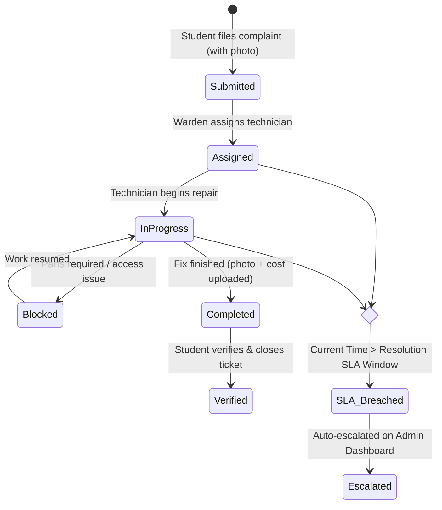
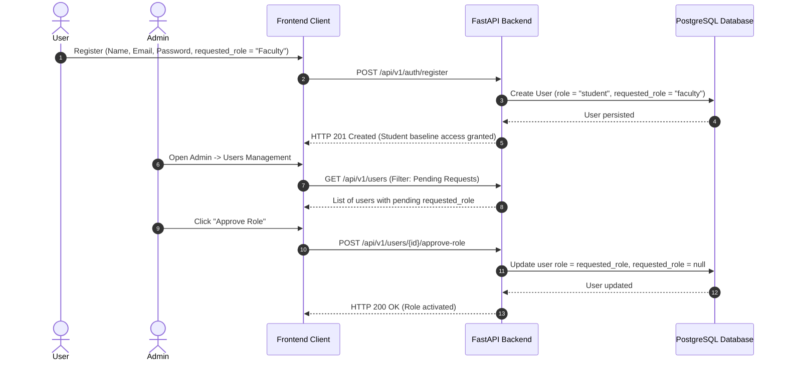
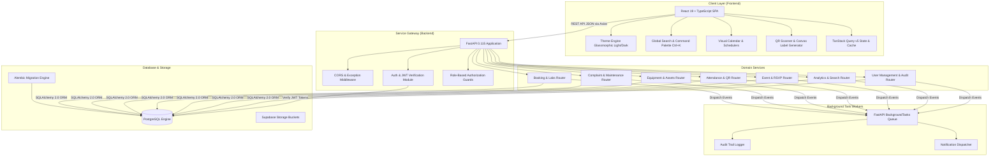
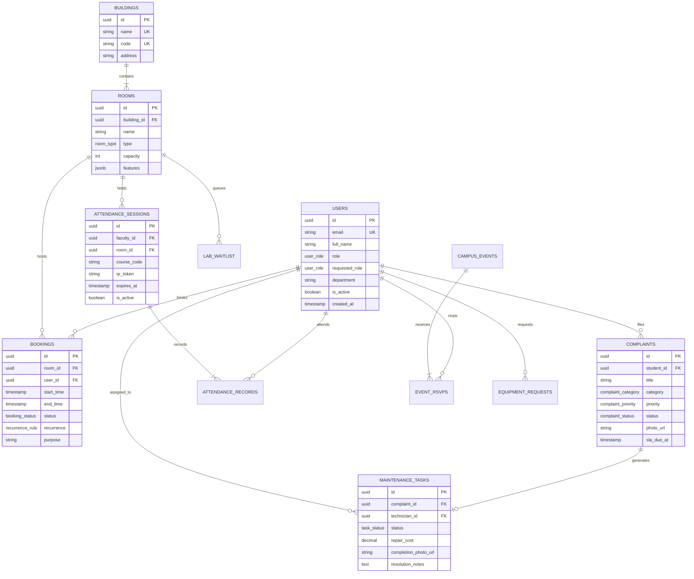

# CampusOne

> **The Unified Smart Campus Operations & Infrastructure Platform**

CampusOne is an enterprise-grade, full-stack SaaS platform engineered to digitize, automate, and streamline day-to-day university campus operations. From conflict-free classroom and lab bookings to SLA-governed hostel maintenance, dynamic anti-share QR attendance, equipment inventory tagging, and campus-wide event orchestration, CampusOne unifies students, faculty, wardens, maintenance crews, and campus administrators into a single, cohesive operating system.

---

## 📑 Table of Contents

- [1. Product Overview](#1-product-overview)
- [2. Key Features](#2-key-features)
- [3. User Roles & Permissions](#3-user-roles--permissions)
- [4. Core Workflows & Flowcharts](#4-core-workflows--flowcharts)
- [5. System Architecture](#5-system-architecture)
- [6. Technology Stack](#6-technology-stack)
- [7. Project Structure](#7-project-structure)
- [8. Prerequisites](#8-prerequisites)
- [9. Installation & Local Setup](#9-installation--local-setup)
- [10. Environment Variables](#10-environment-variables)
- [11. Authentication & Authorization](#11-authentication--authorization)
- [12. API Documentation](#12-api-documentation)
- [13. Database Schema & Models](#13-database-schema--models)
- [14. Modules & Implementation Status](#14-modules--implementation-status)
- [15. UI/UX Highlights](#15-ui-ux-highlights)
- [16. Security & Governance](#16-security--governance)
- [17. Testing & Quality Gates](#17-testing--quality-gates)
- [18. Docker & Containerization](#18-docker--containerization)
- [19. Deployment Guide](#19-deployment-guide)
- [20. Development Workflow](#20-development-workflow)
- [21. Troubleshooting Guide](#21-troubleshooting-guide)
- [22. Roadmap](#22-roadmap)
- [23. Contributing](#23-contributing)
- [24. License](#24-license)
- [25. Author](#25-author)

---

## 1. Product Overview

University campuses struggle with fragmented spreadsheets, siloed department software, paper logs, and manual approvals for room scheduling, maintenance requests, lost property, and student attendance. 

**CampusOne** solves this fragmentation through:
- **Centralized Operational Hub**: Eliminates administrative overhead by providing real-time data across academic buildings, hostel blocks, and shared resources.
- **Automated Conflict Prevention**: Prevents double-booking across lecture halls, smart classrooms, and specialized laboratory seats using strict database-level constraints.
- **SLA-Enforced Maintenance**: Tracks maintenance lifecycle stages with automated urgency escalations to resolve hostel and infrastructure complaints on time.
- **Anti-Fraud Attendance**: Uses dynamic, auto-rotating QR session tokens to prevent student proxy attendance and screenshot sharing.
- **Enterprise Auditability**: Records every status change, booking approval, role modification, and equipment handover in an immutable audit ledger.

---

## 2. Key Features

### 🏛️ Classroom & Space Reservation
- **Multi-Filter Availability Search**: Query spaces by date, time window, minimum seating capacity, and room type (e.g., lecture hall, seminar room, smart classroom).
- **Recurring Schedule Engine**: Support for one-off and recurring reservations (daily, weekly, monthly).
- **Admin Approval Pipeline**: Pending bookings are reviewed by administrators with instant approve/reject actions and rejection reasoning.
- **Conflict Prevention**: Exclusion-aware validation prevents double-booking rooms and maintenance blackouts.

### 🧪 Specialized Laboratory Reservations & Waitlisting
- **Interactive Seat Picker**: Visual seat grid representation of computer labs, robotics labs, physics labs, etc.
- **Real-Time Seat Occupation**: Real-time occupancy status per workstation/bench.
- **Automated Waitlist Queue**: Auto-queues students and faculty when laboratory capacity is exhausted.

### 🛠️ Hostel Complaints & Maintenance SLAs
- **Multi-Category Reporting**: File complaints across Electrical, Plumbing, HVAC, Carpentry, Masonry, and Internet categories.
- **Photo Evidence Attachment**: Upload photo proof during ticket submission and after maintenance completion.
- **Warden Dispatch Queue**: Wardens review submitted complaints and assign technician specialists.
- **SLA Escalation Timer**: Critical, high, medium, and low priority tickets have strict resolution time windows that automatically flag breached SLAs on administrative dashboards.
- **Student Verification Loop**: Work orders are only marked resolved once the student inspects and verifies the fix.

### 📦 Equipment Inventory & Asset Tagging
- **Dynamic Asset Tag Generation**: Instant generation of scannable QR barcode property tags for printing and physical asset labelling.
- **Faculty Borrow Requests**: Faculty can request projectors, smart boards, computers, and specialized lab equipment with specified duration and quantity.
- **Lifecycle Auditing**: Track equipment status (`available`, `in_use`, `maintenance`, `retired`) and condition ratings.

### 📅 Campus Event Management & RSVP
- **Interactive Month/Week Calendar**: Visual calendar highlighting university symposia, workshops, sports events, and cultural fests.
- **Event Scheduling**: Faculty and admins create events linked directly to reserved campus venues.
- **RSVP & Capacity Tracking**: One-click attendee RSVP tracking with live count vs. max capacity limits.

### 🔍 Lost & Found Registry
- **Campus-Wide Item Feed**: Community lost & found directory filterable by category and status (`lost`, `found`, `claimed`, `returned`).
- **Discovery Posting**: Upload photos, location details, and descriptions for recovered items.
- **Claim & Verification**: Secure claim logging to return items to their rightful owners.

### 📱 Anti-Share QR Attendance System
- **15-Second Rotating Token**: Faculty generate live lecture sessions where the QR token regenerates every 15 seconds to prevent screenshot sharing and remote proxy attendance.
- **Integrated Scanner & Manual Token Input**: Students scan live QR codes via camera or submit the 6-character active rotating code.
- **Session Attendance Reports**: Instant summary of present students, timestamps, and attendance rates with CSV export.

### ⚡ Global Command Palette & Navigation
- **`Ctrl+K` Omnisearch**: Universal search palette indexing campus buildings, rooms, equipment, bookings, lost items, and user directories in real time.
- **Role-Aware Sidebar**: Dynamic navigation strictly tailored to the authenticated user's permission scope.

### 🔔 Centralized Notifications Center
- **Live Badge & Unread Feeds**: Unread notifications for booking approvals, technician task assignments, complaint status updates, and event RSVPs.
- **Configurable Dispatch Settings**: Admin dashboard to toggle in-app and email channels across system events.

### 📊 Analytics & Audit Logging
- **Visual Analytics Dashboard**: Utilization charts, complaint distribution by category, attendance adherence, equipment status breakdown, and maintenance expenditure logs.
- **CSV Data Exporters**: One-click export for users directory, room registries, booking logs, and attendance rosters.
- **Immutable Audit Trail**: Chronological log capturing timestamp, actor ID, action name, target resource, and before/after state diffs.

---

## 3. User Roles & Permissions

CampusOne implements strict Role-Based Access Control (RBAC) across 5 primary roles:

| Role | Target Persona | Primary Capabilities | Restrictions |
| :--- | :--- | :--- | :--- |
| **`student`** | Enrolled Students | • Reserve lab workstations & join waitlists<br>• Submit hostel complaints & verify completed fixes<br>• Scan dynamic QR attendance for lectures<br>• View event calendar & RSVP<br>• Report & search Lost & Found items | • Cannot book whole classrooms<br>• Cannot generate attendance codes<br>• Cannot access admin controls |
| **`faculty`** | Professors & Lecturers | • Book classrooms & seminar halls (with recurrence)<br>• Reserve laboratory seats<br>• Schedule campus events<br>• Generate rotating QR attendance sessions<br>• Request loanable equipment<br>• View student attendance reports | • Cannot assign maintenance personnel<br>• Cannot approve other faculty bookings<br>• Cannot access system audit logs |
| **`warden`** | Hostel Wardens | • Access central hostel complaint queue<br>• Assign maintenance tasks to technicians<br>• Monitor SLA compliance and breached repair orders<br>• View hostel operational analytics | • Cannot create academic bookings<br>• Cannot manage system-wide user roles |
| **`maintenance_staff`** | Technicians & Electricians | • View personalized assigned task queue<br>• Transition tasks (`in_progress`, `completed`, `blocked`)<br>• Upload completion photos and record repair costs | • Cannot reassign work orders<br>• Cannot access student/faculty academic records |
| **`admin`** | Campus Operations Team | • Full operational control across all campus entities<br>• Approve or reject room bookings<br>• Approve/reject requested role elevations<br>• Manage users, buildings, rooms, and equipment inventory<br>• View system audit logs and analytics reports<br>• Configure notification delivery settings | • Superuser access across all modules |

---

## 4. Core Workflows & Flowcharts

### 1. Classroom Booking & Conflict Prevention



### 2. Anti-Share QR Attendance System



### 3. Hostel Maintenance & SLA Escalation Lifecycle



### 4. User Registration & Role Elevation



---

## 5. System Architecture

CampusOne utilizes a modern decoupled architecture where a React single-page application interacts with a high-performance Python FastAPI service, backed by PostgreSQL and Supabase infrastructure.



---

## 6. Technology Stack

### Frontend

| Technology | Version | Purpose |
| :--- | :--- | :--- |
| **React** | `19.0.0` | Declarative component UI library |
| **TypeScript** | `5.7.2` | Static type safety and strict schema checking |
| **Vite** | `6.0.5` | Next-generation frontend build tooling and HMR dev server |
| **Tailwind CSS** | `3.4.17` | Utility-first design system with custom color palette |
| **React Router** | `7.1.1` | Client-side routing and layout composition |
| **TanStack React Query** | `5.62.7` | Server state management, auto-caching, and mutations |
| **React Hook Form** | `7.54.2` | Performant form state management and submission |
| **Zod** | `3.24.1` | Client-side runtime schema validation |
| **Chart.js & React-Chartjs-2** | `4.4.7` / `5.3.0` | Interactive dashboard visualization charts |
| **qrcode.react** | `4.2.0` | Dynamic client-side QR code canvas generation |
| **Axios** | `1.7.9` | HTTP client with automatic auth header injection |
| **Vitest & Testing Library** | `3.0.5` / `16.1.0` | Unit and component integration testing |

### Backend

| Technology | Version | Purpose |
| :--- | :--- | :--- |
| **FastAPI** | `0.115.6` | Asynchronous, OpenAPI-compliant Python web framework |
| **Python** | `3.12+` | Modern typed Python runtime environment |
| **SQLAlchemy** | `2.0.36` | SQL toolkit and Object-Relational Mapper (ORM) |
| **Alembic** | `1.14.0` | Database schema versioning and migration engine |
| **Pydantic** | `2.10.3` | Request/response data validation and serialization |
| **Pydantic Settings** | `2.6.1` | Environment variable parsing and configuration management |
| **Psycopg 3** | `3.2.3` | High-performance PostgreSQL database driver |
| **Python-Jose** | `3.3.0` | JSON Web Token (JWT) encoding, decoding, and verification |
| **Supabase-py** | `2.10.0` | Python client for Supabase Auth, Storage, and Database |
| **Uvicorn** | `0.32.1` | Lightning-fast ASGI web server implementation |
| **Pytest & Pytest-Asyncio**| `8.3.4` / `0.24.0`| Unit and integration testing framework |

### Database & Infrastructure

| Technology | Version | Purpose |
| :--- | :--- | :--- |
| **PostgreSQL** | `16+` | Relational database with transactional exclusion constraints |
| **Supabase** | Cloud / Local | Managed PostgreSQL, Auth service, and Storage engine |
| **Docker & Compose** | `3.8` | Containerized development and backend deployment |

---

## 7. Project Structure

```
smart-campus-platform/
├── backend/
│   ├── app/
│   │   ├── core/                  # Core modules (config, security, database, errors, logging)
│   │   │   ├── config.py          # Pydantic environment configuration
│   │   │   ├── database.py        # SQLAlchemy session lifecycle management
│   │   │   ├── errors.py          # Custom AppError hierarchy & exception handlers
│   │   │   ├── logging.py         # Structured logging configuration
│   │   │   ├── security.py        # JWT verification, RBAC dependency factories
│   │   │   ├── storage.py         # File upload abstraction & Supabase storage
│   │   │   └── supabase.py        # Service-role Supabase client wrapper
│   │   ├── models/                # SQLAlchemy database models
│   │   │   ├── audit.py           # AuditLog model
│   │   │   ├── campus.py          # Building & Room models
│   │   │   ├── complaint.py       # Complaint model
│   │   │   ├── equipment.py       # Equipment & EquipmentRequest models
│   │   │   ├── event.py           # CampusEvent & EventRSVP models
│   │   │   ├── lost_found.py      # LostItem model
│   │   │   ├── maintenance.py     # MaintenanceTask model
│   │   │   ├── notification.py    # Notification & NotificationSetting models
│   │   │   ├── reservation.py     # Booking & LabWaitlistEntry models
│   │   │   ├── session.py         # AttendanceSession & AttendanceRecord models
│   │   │   └── user.py            # User model with Role enum
│   │   ├── services/              # Domain routers, business logic & Pydantic schemas
│   │   │   ├── analytics/         # Utilization, complaint & equipment analytics
│   │   │   ├── attendance/        # QR attendance generation, rotation & scanning
│   │   │   ├── audit/             # Audit trail queries & background writer
│   │   │   ├── auth/              # Registration, login, profile & OAuth sync
│   │   │   ├── booking/           # Room & lab bookings, conflict checks & waitlists
│   │   │   ├── campus/            # Buildings and rooms catalog
│   │   │   ├── complaint/         # Complaint lifecycle & assignment
│   │   │   ├── equipment/         # Inventory management & borrow requests
│   │   │   ├── event/             # Event scheduling & attendee RSVPs
│   │   │   ├── lost_found/        # Lost and found item posting & claiming
│   │   │   ├── maintenance/       # Technician work orders, cost & photo upload
│   │   │   ├── notification/      # In-app notifications & channel settings
│   │   │   ├── search/            # Universal campus search
│   │   │   └── users/             # User directory & role approval management
│   │   └── main.py                # FastAPI application entry point & router mounting
│   ├── migrations/                # Alembic database migrations
│   │   └── versions/              # Schema version snapshots
│   ├── tests/                     # Backend test suite
│   │   ├── integration/           # Integration tests with test DB & mocked Supabase
│   │   └── unit/                  # Unit tests (e.g. complaint state machine)
│   ├── alembic.ini                # Alembic configuration
│   ├── Dockerfile                 # Backend container definition
│   ├── pyproject.toml             # Python tools configuration (pytest, ruff, mypy)
│   ├── requirements.txt           # Core production dependencies
│   └── requirements-dev.txt       # Development & test dependencies
├── frontend/
│   ├── src/
│   │   ├── components/            # Reusable UI components
│   │   │   ├── layout/            # AppShell, Navbar, Sidebar, Navigation
│   │   │   └── ui/                # Button, PlaqueCard, StatusBadge, TextField, CommandPalette
│   │   ├── core/                  # Core frontend infrastructure
│   │   │   ├── api/               # Axios client, token store, and error handling
│   │   │   ├── auth/              # AuthContext, RequireAuth, RequireRole, useAuth
│   │   │   └── theme/             # ThemeContext, useTheme, dark/light mode toggle
│   │   ├── features/              # Feature modules (pages, API queries, types)
│   │   │   ├── admin/             # Admin users, rooms, equipment, bookings
│   │   │   ├── analytics/         # Reports & charts dashboard
│   │   │   ├── attendance/        # QR generator, scanner, and report views
│   │   │   ├── audit/             # Audit log explorer
│   │   │   ├── auth/              # Landing, Login, Register, Forgot Password
│   │   │   ├── booking/           # Room & lab booking forms, my bookings
│   │   │   ├── campus/            # Campus API hooks & types
│   │   │   ├── complaint/         # Complaint submission, queue & assignment
│   │   │   ├── dashboard/         # Role-specific dashboard views
│   │   │   ├── equipment/         # Faculty equipment request page
│   │   │   ├── event/             # Event calendar & schedule form
│   │   │   ├── lostfound/         # Lost & found directory
│   │   │   ├── maintenance/       # Technician task list & update modals
│   │   │   ├── notification/      # Notification bell & notification center
│   │   │   └── profile/           # User profile editor
│   │   ├── routes/                # Navigation configurations
│   │   ├── utils/                 # CSV export & formatting helpers
│   │   ├── App.tsx                # Application routes & role gates
│   │   ├── index.css              # Global styles, Tailwind directives & custom classes
│   │   └── main.tsx               # Frontend entry point (React DOM render)
│   ├── index.html                 # Single page HTML entry
│   ├── package.json               # Frontend dependencies & scripts
│   ├── tailwind.config.ts         # Tailwind design tokens & colors
│   ├── tsconfig.json              # TypeScript compilation settings
│   └── vite.config.ts             # Vite configuration & path aliases
├── docker-compose.yml             # Local multi-service orchestration (Postgres + Backend)
└── README.md                      # Comprehensive project documentation
```

---

## 8. Prerequisites

Before running CampusOne locally, ensure the following runtimes are installed:

- **Node.js**: `v20.0.0` or higher
- **npm**: `v10.0.0` or higher
- **Python**: `3.12` or higher
- **PostgreSQL**: `16+` (or a free cloud [Supabase](https://supabase.com) project)
- **Docker & Docker Compose** *(Optional, for containerized execution)*

---

## 9. Installation & Local Setup

### 1. Clone the Repository
```bash
git clone https://github.com/your-username/smart-campus-platform.git
cd smart-campus-platform
```

---

### 2. Backend Setup

1. **Navigate to backend and create a virtual environment**:
   ```bash
   cd backend
   python -m venv .venv
   ```

2. **Activate the virtual environment**:
   - **Windows (PowerShell)**:
     ```powershell
     .venv\Scripts\Activate.ps1
     ```
   - **Windows (CMD)**:
     ```cmd
     .venv\Scripts\activate.bat
     ```
   - **macOS / Linux**:
     ```bash
     source .venv/bin/activate
     ```

3. **Install dependencies**:
   ```bash
   pip install -r requirements.txt -r requirements-dev.txt
   ```

4. **Configure environment variables**:
   ```bash
   cp .env.example .env
   ```
   *(Populate your `.env` with Supabase/Postgres connection parameters as detailed in [Environment Variables](#10-environment-variables).)*

5. **Run database migrations**:
   ```bash
   alembic upgrade head
   ```

6. **Start the FastAPI development server**:
   ```bash
   python -m uvicorn app.main:app --port 8000 --reload
   ```
   *The backend API will be live at `http://localhost:8000`.*

---

### 3. Frontend Setup

1. **Navigate to the frontend directory**:
   ```bash
   cd ../frontend
   ```

2. **Install Node modules**:
   ```bash
   npm install
   ```

3. **Configure environment variables**:
   ```bash
   cp .env.example .env
   ```

4. **Start the Vite development server**:
   ```bash
   npm run dev
   ```
   *The frontend application will be accessible at `http://localhost:5173`.*

---

### 4. Running with Docker Compose (Optional)

To spin up a local PostgreSQL 16 container and the backend service simultaneously:
```bash
docker compose up -d
```
*To stop the containers:*
```bash
docker compose down
```

---

## 10. Environment Variables

### Backend Configuration (`backend/.env`)

| Variable | Used By | Required | Description | Example / Default |
| :--- | :--- | :---: | :--- | :--- |
| `DATABASE_URL` | SQLAlchemy / Alembic | **Yes** | PostgreSQL connection URI (with `psycopg` driver) | `postgresql+psycopg://postgres.<ref>:<pwd>@aws-0-ap-southeast-2.pooler.supabase.com:6543/postgres` |
| `SUPABASE_URL` | Supabase SDK / Auth | **Yes** | Supabase project base URL | `https://<your-project-ref>.supabase.co` |
| `SUPABASE_SERVICE_KEY`| Backend Supabase SDK | **Yes** | Supabase service-role secret key (never exposed to frontend) | `eyJhbGciOi...` |
| `JWT_SECRET` | Auth Token Decoder | **Yes** | Secret used to verify HS256-signed JWT tokens | `your-jwt-secret-string` |
| `ALLOWED_CORS_ORIGINS`| CORS Middleware | No | Comma-separated list of allowed frontend origins | `http://localhost:5173,http://localhost:3000` |
| `ENV` | Application Core | No | Runtime environment (`local`, `staging`, `production`) | `local` |

### Frontend Configuration (`frontend/.env`)

| Variable | Used By | Required | Description | Example / Default |
| :--- | :--- | :---: | :--- | :--- |
| `VITE_API_BASE_URL` | Axios API Client | **Yes** | Root endpoint prefix for the backend REST API | `http://localhost:8000/api/v1` |
| `VITE_SUPABASE_URL` | Supabase Client | **Yes** | Supabase project URL for frontend auth callbacks | `https://<your-project-ref>.supabase.co` |
| `VITE_SUPABASE_ANON_KEY`| Supabase Client | **Yes** | Supabase public anon key | `eyJhbGciOi...` |

---

## 11. Authentication & Authorization

CampusOne uses a layered security model:

```
┌─────────────────────────────────────────────────────────────┐
│                    Client (React Router)                    │
│      RequireAuth: Checks token existence in localStorage    │
│      RequireRole: Gates routes by user.role claim           │
└──────────────────────────────┬──────────────────────────────┘
                               │ Bearer Token in Header
                               ▼
┌─────────────────────────────────────────────────────────────┐
│                   Backend (FastAPI Layer)                   │
│   1. get_current_user: Decodes JWT (HS256/RS256 via JWKS)   │
│   2. Resolves User row from PostgreSQL (verifies is_active) │
│   3. require_role: Rejects unauthorized roles with HTTP 403 │
└──────────────────────────────┬──────────────────────────────┘
                               │
                               ▼
┌─────────────────────────────────────────────────────────────┐
│                   Supabase Auth Service                     │
│   Issues signed session tokens, handles OAuth redirects,    │
│   and enforces secure password hashing.                     │
└─────────────────────────────────────────────────────────────┘
```

### Key Security Policies:
1. **Self-Registration Baseline**: All newly registered accounts default to the `student` role (ADR-010). If an elevated role (e.g. `faculty`, `warden`, `maintenance_staff`, `admin`) is selected during registration, it is recorded as a `requested_role` that requires administrator approval via `POST /api/v1/users/{id}/approve-role`.
2. **Stateless JWTs**: Access tokens are validated server-side without round-tripping to Supabase for every request when using shared secret verification.
3. **No Role Escalation on Client**: The client's stored user role is purely used for UI display; the backend independently resolves the authenticated database record on every protected API call.

---

## 12. API Documentation

When the backend is running, interactive OpenAPI documentation is generated automatically:

- **Swagger UI**: [http://localhost:8000/docs](http://localhost:8000/docs)
- **ReDoc UI**: [http://localhost:8000/redoc](http://localhost:8000/redoc)
- **Health Probe**: `GET http://localhost:8000/health`

### Major Endpoint Groups (`/api/v1`)

```
/api/v1
├── /auth                  # Authentication, Registration, Password Reset, /me
├── /users                 # User directory, Role approvals, Activation toggles
├── /campus                # Buildings and Rooms catalog
├── /bookings              # Classroom reservations, approvals, cancellations
├── /labs                  # Lab seat availability, workstation reservations, waitlists
├── /complaints            # Hostel complaint submission, assignment, verification
├── /maintenance           # Work orders, task status, completion photo & costing
├── /equipment             # Equipment inventory, property tags, borrow requests
├── /events                # Campus events calendar, scheduling, RSVP attendee list
├── /lost-found            # Lost & Found postings, claims, status updates
├── /attendance            # Dynamic QR session generation, rotation, scanning, reports
├── /notifications         # User notifications, mark-as-read, admin settings
├── /search                # Universal campus omnisearch
├── /analytics             # Room utilization, complaint metrics, attendance rates
└── /audit                 # Immutable system audit logs
```

---

## 13. Database Schema & Models

CampusOne models are structured around PostgreSQL relational integrity:



---

## 14. Modules & Implementation Status

| Module | Core Capabilities | Implementation Status |
| :--- | :--- | :---: |
| **Authentication & RBAC** | Email/Password, OAuth Just-in-Time provisioning, Role request & approval pipeline, JWT decoding | ✅ **Complete** |
| **Classroom Booking** | Conflict-free room reservation, recurring schedules, admin approval/rejection workflow, cancellation | ✅ **Complete** |
| **Lab Reservation** | Visual seat grid, workstation booking, auto-waitlist queue | ✅ **Complete** |
| **Hostel Complaints** | Photo attachments, warden assignment, technician resolution, student verification loop | ✅ **Complete** |
| **Maintenance & SLA** | Technician task queue, status updates, repair cost tracking, SLA countdown & breach escalation | ✅ **Complete** |
| **Equipment & Assets** | Printable QR property tag generator, inventory management, faculty borrow request approval flow | ✅ **Complete** |
| **Event Calendar** | Interactive month/week calendar, event creation, attendee RSVP tracking | ✅ **Complete** |
| **Lost & Found** | Item posting with photos, status transition (`lost` $\to$ `found` $\to$ `claimed` $\to$ `returned`) | ✅ **Complete** |
| **QR Attendance** | 15-second rotating anti-share tokens, mobile camera QR scanner, attendance rosters & CSV export | ✅ **Complete** |
| **Omnisearch Palette** | Global `Ctrl+K` command palette indexing all campus entities | ✅ **Complete** |
| **Notifications Center**| In-app notification bell, unread indicators, admin notification dispatch configuration | ✅ **Complete** |
| **Analytics & Reporting**| Room utilization charts, complaint stats, attendance percentages, maintenance expenditure | ✅ **Complete** |
| **Audit Logging** | Immutable change logging with before/after state diff capture | ✅ **Complete** |
| **Hostel Ward Reports**| Dedicated hostel block metrics view (`/reports/hostel`) | 🟡 **Partial (Placeholder UI)** |
| **Push / SMS Gateway** | Mobile push notifications & SMS alerts | 🔵 **Planned** |

---

## 15. UI/UX Highlights

- **Aesthetic Glassmorphism**: Tailored theme featuring subtle backdrop blurs, dark slate canvas, clean plaque cards, and brass accent highlights.
- **Theme Switcher**: Instant transition between dark mode and crisp high-contrast light mode.
- **Responsive Layout**: Designed for seamless usage across desktop monitors, tablets, and mobile browser viewports.
- **Micro-Interactions**: Real-time validation feedback, animated pulse indicators for SLA breaches, and skeleton loading states for high-traffic queries.
- **Accessible Color Semantics**: Status badges utilize distinct color ramps for quick visual comprehension (`emerald` for confirmed/completed, `amber` for pending/in-progress, `rose` for rejected/breached).

---

## 16. Security & Governance

- **Role Authorization at Database Boundary**: APIs enforce authorization checks at the router dependency layer before accessing database sessions.
- **Double-Booking Prevention**: PostgreSQL exclusion constraints ensure zero overlap for confirmed reservations.
- **Input Sanitization & Schema Validation**: Strict Pydantic models on backend and Zod schemas on frontend reject malformed payloads.
- **Secure File Storage**: File uploads are restricted by size and extension before routing to Supabase Storage.
- **No Plaintext Passwords**: User credential storage is managed through Supabase Auth (bcrypt hashing).

---

## 17. Testing & Quality Gates

CampusOne includes comprehensive automated test suites for both frontend and backend.

### Running Frontend Tests & Checks
```bash
cd frontend

# Run unit and component integration tests (Vitest)
npm run test

# Type-check TypeScript codebase
npm run typecheck

# Run ESLint linter
npm run lint

# Validate code formatting
npm run format:check

# Compile production bundle
npm run build
```

### Running Backend Tests & Checks
```bash
cd backend

# Activate virtual environment
.venv\Scripts\activate   # (or source .venv/bin/activate on Unix)

# Run full Pytest test suite
pytest

# Run static type checker
mypy app

# Run Ruff linter
ruff check .

# Validate Black code formatting
black --check .
```

---

## 18. Docker & Containerization

A complete Docker configuration is included for consistent local execution and container deployment:

- **`backend/Dockerfile`**: Slim Python 3.12 image with compiled PostgreSQL drivers.
- **`docker-compose.yml`**: Spins up PostgreSQL 16 container and attaches the backend service with volume mounting for hot reload.

```bash
# Start all services in the background
docker compose up -d

# View real-time backend logs
docker compose logs -f backend

# Shut down services and preserve database volume
docker compose down
```

---

## 19. Deployment Guide

### Frontend Deployment (Vercel / Netlify / Cloudflare Pages)
1. Build the production bundle:
   ```bash
   cd frontend
   npm run build
   ```
2. Configure your hosting platform with the output directory: `frontend/dist`.
3. Set the production environment variables:
   - `VITE_API_BASE_URL=https://api.yourdomain.com/api/v1`
   - `VITE_SUPABASE_URL=https://<your-project>.supabase.co`
   - `VITE_SUPABASE_ANON_KEY=<your-anon-key>`

### Backend Deployment (Render / Railway / AWS ECS / Fly.io)
1. Set up container build using `backend/Dockerfile` or native Python 3.12 environment.
2. Supply environment variables in your hosting provider's secrets manager:
   - `DATABASE_URL`
   - `SUPABASE_URL`
   - `SUPABASE_SERVICE_KEY`
   - `JWT_SECRET`
   - `ALLOWED_CORS_ORIGINS=https://campus.yourdomain.com`
   - `ENV=production`
3. Execute database migrations during deployment release phase:
   ```bash
   alembic upgrade head
   ```
4. Start command:
   ```bash
   uvicorn app.main:app --host 0.0.0.0 --port 8000 --workers 4
   ```

---

## 20. Development Workflow

When contributing or extending features in CampusOne:

1. **Create a Feature Branch**:
   ```bash
   git checkout -b feature/your-feature-name
   ```
2. **Backend Changes**:
   - Update SQLAlchemy models in `backend/app/models/`.
   - Generate an Alembic migration: `alembic revision --autogenerate -m "describe change"`.
   - Apply migration: `alembic upgrade head`.
   - Implement router endpoints in `backend/app/services/<feature>/router.py`.
3. **Frontend Changes**:
   - Define TypeScript interfaces in `frontend/src/features/<feature>/types.ts`.
   - Write React Query hooks in `frontend/src/features/<feature>/api.ts`.
   - Build UI pages and components in `frontend/src/features/<feature>/`.
   - Mount new routes in `frontend/src/App.tsx` and register navigation items in `frontend/src/routes/navigation.ts`.
4. **Run Quality Gates**:
   - Execute `npm run typecheck && npm run test` in `frontend/`.
   - Execute `pytest && mypy app` in `backend/`.

---

## 21. Troubleshooting Guide

### 1. `Could not create account. The email may already be registered.` or DNS Resolution Failure
- **Cause**: The backend cannot communicate with the Supabase Auth or database endpoint (often because an inactive Supabase free-tier project has been paused).
- **Solution**: Log into [Supabase Dashboard](https://supabase.com/dashboard), navigate to your project, and click **Restore / Unpause Project**. Once unpaused, verify that `SUPABASE_URL` and `DATABASE_URL` in `backend/.env` match the active project.

### 2. CORS Errors in Browser Console
- **Cause**: The frontend origin is not present in the backend's allowed origins list.
- **Solution**: Check `ALLOWED_CORS_ORIGINS` in `backend/.env`. Ensure it includes your exact frontend URL (e.g. `http://localhost:5173`).

### 3. Alembic Migration Overlap / Type Errors
- **Cause**: Database schema is out of sync with migration history.
- **Solution**: Run `alembic upgrade head` from the `backend/` directory while connected to your database.

### 4. Port Conflicts (`8000` or `5173` already in use)
- **Solution**: 
  - For backend: `python -m uvicorn app.main:app --port 8001 --reload`
  - For frontend: Update `server.port` in `frontend/vite.config.ts` or run `npm run dev -- --port 5174`.

---

## 22. Roadmap

Future enhancements designed to expand CampusOne:

- **Hostel Room Allocation Matrix**: Automated room allotter matching students to hostel blocks based on branch and year.
- **Multi-Channel Push Notifications**: Native Web Push and WhatsApp/SMS gateway integration for urgent maintenance alerts.
- **PDF Export Engine**: Server-side PDF export for official attendance certificates and equipment audit statements.
- **Smart Energy IoT Integration**: Integration with smart meters to track real-time classroom electricity and AC consumption.

---

## 23. Contributing

Contributions are welcome! Please follow these steps:

1. Fork the repository.
2. Create your feature branch (`git checkout -b feature/amazing-feature`).
3. Commit your changes (`git commit -m 'feat: Add amazing feature'`).
4. Push to the branch (`git push origin feature/amazing-feature`).
5. Open a Pull Request with a clear description of the changes and test results.

---

## 24. License

This project is licensed under the MIT License - see the [LICENSE](LICENSE) file for details.

---

## 25. Author

**VARDHANKANDA**

---

<p align="center">
  <b>CampusOne</b> · Empowering modern educational institutions through unified digital infrastructure.
</p>
